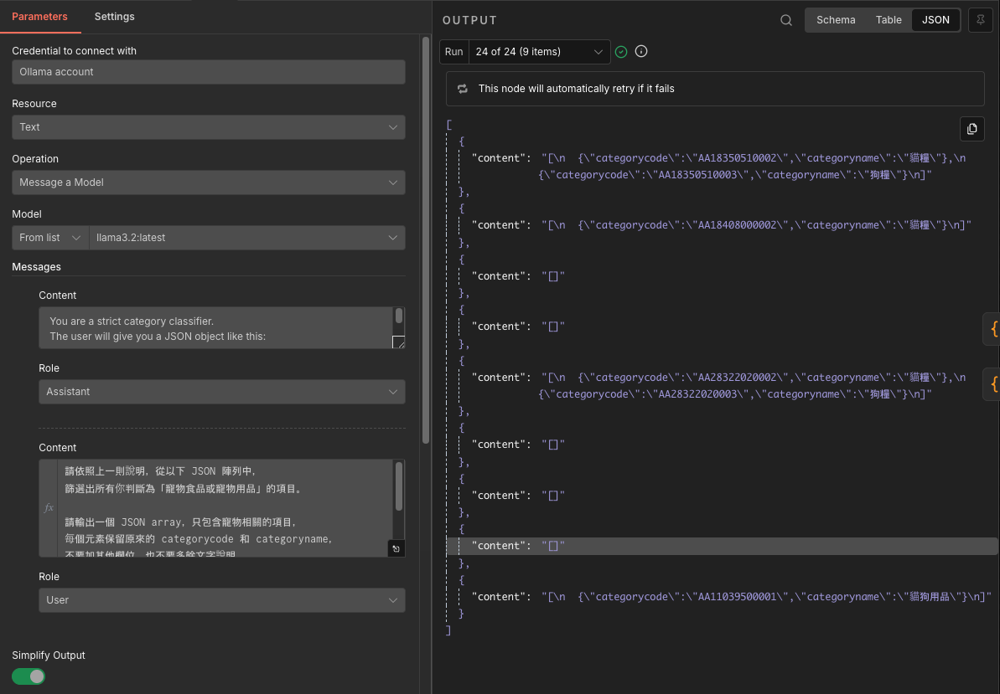
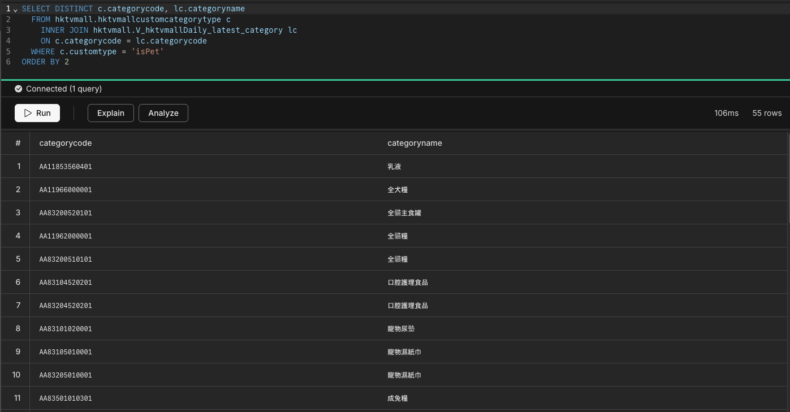

# Orchestrating n8n + LLM + AI-Assisted Coding

Personal project showcase – end-to-end automation for finding discounted near-expiry "green" products using HKTVmall price history

**Live demo**: [View Web App →](https://your-vercel-app-url.vercel.app)

**Interactive Slides:** [Open Presentation on Gamma →](https://gamma.app/public/ko7hcmfutkleg6a)

---

## Slide 1 – Project Overview

**Project Showcase: Orchestrating n8n + LLM + AI-assisted Coding**

A personal side project driven by my interest in hunting for discounted near-expiry "green" products.  
I chose **HKTVmall** as the data source thanks to its detailed price history.

**Tech stack demonstrated:**

- **GitHub** → YOU ARE HERE!
- **Docker** → Containerized runtime for n8n and Ollama to enable consistent data collection and AI processing
- **n8n workflows** → Product discovery from HKTVmall, price history retrieval, and AI-assisted analysis to identify preferred categories for personalized search
- **Ollama LLM** → Selected lightweight local model to accommodate hardware limitations
- **Cursor.ai** → Accelerated development through AI pair-programming — highly effective for this non-sensitive prototype
- **Vercel** → Seamless deployment of the interactive web showcase, leveraging free-tier Neon PostgreSQL for data persistence

---

## 2 – Example Deep Discount

**Identifying Deep Discounts on Near-Expiry Green Products**

Example: A near-expiry green product on HKTVmall  
Current price: **HK$10** | Historical max price: **HK$70**

This project calculates the real discount using:

$$    
\text{Discount (\%)} = \left( \frac{1 - P_{\text{current}}}{P_{\text{max}}} \right) \times 100
    $$

**Result for this example:** ≈ **85.7%**

- Shows how n8n + LLM automate spotting these opportunities from price history
- Turns raw e-commerce data into personalized deal dashboard

<image-card alt="HKTVmall product example – current price HK$10 and history up to HK$70" src="screenshots/hktvmall-product-example.png" ></image-card>

---

## 3 – Solving Real Shopping Pain Points

**Solving Real Shopping Pain Points on HKTVmall**

HKTVmall's product listings have clear limitations for deal hunters:

- No built-in sorting by **discount rate** — impossible to quickly find the best near-expiry deals
- No native **"exclude"** filter for categories (e.g., skip all pet food while browsing groceries)

This project addresses these issues by using n8n workflows + AI analysis to:

- Fetch and **rank** products by calculated discount percentage
- Apply **personal preferences** (exclude unwanted categories)
- Enable faster, smarter searching for green/near-expiry bargains

<image-card alt="HKTVmall product list page – showing no discount sorting or exclude options" src="screenshots/hktvmall-list-no-features.png" ></image-card>

---

## 4 – Live Web Application Demo

**Live Demo: Personalized Deal Finder in Action**

The finished interactive web app – deployed and ready to use.
*but data not up-to-date. Schedule job should work, but could be recongized as DDOS for frequent data retrieval.

Key features you can see in the screenshot:

- Calculated discount percentages with sorting
- Custom filters (exclude categories with AI-assisted analysis)
- Clean, responsive UI hosted on Vercel

<image-card alt="Web App main view – product list with discounts, sorting, and filters" src="screenshots/web-app-main-view.png" ></image-card>

**Live URL**: [https://your-vercel-app-url.vercel.app](https://your-vercel-app-url.vercel.app)

---

## 5 - How the n8n Workflow Orchestrates Everything

**Behind the Scenes: n8n as the Central Orchestrator**

n8n ties the entire pipeline together with modular, visual workflows:

Main flow steps:

**Why n8n?**  
No-code visual builder + great Docker support + native Ollama integration = perfect for rapid local prototyping

![n8n workflow canvas – full pipeline from scrape to AI analysis]

- **Get Products per Store**
- This workflow manages API requests and data parsing to fetch product listings from HKTVmall stores.

<image-card alt="Main workflow to get prodcuts per store" src="screenshots/n8n-workflow-1.png" ></image-card>

- **Price History Subflow**
- Responsible for retrieving and enriching price history data for products, including database lookups and data merging.

<image-card alt="Main workflow to get prodcuts per store" src="screenshots/n8n-workflow-2.png" ></image-card>

- **AI Category Tagging**
- Utilizes the Ollama LLM for AI-assisted category analysis and tagging, processing text and updating database nodes.

<image-card alt="Main workflow to get prodcuts per store" src="screenshots/n8n-workflow-3.png" ></image-card>

---

## 6 - Prompt Engineering - Designing the LLM Prompt

**The Challenge**

Ollama's local model (llama3.2:latest) runs under tight memory constraints. The prompt must be precise and structured to extract reliable JSON output without verbose reasoning or hallucinated fields.

**Key Design Decisions**
- Strict output schema: Model instructed to return only a valid JSON object — nothing else
- Bilingual examples: Traditional Chinese category names included to guide classification accuracy
- Fallback handling: Empty string returned when no pets match — prevents null errors downstream
- Two-role structure: System role sets the classifier persona; user role injects live data via JSON.stringify($json)

Keeping the prompt bilingual and schema-locked was critical to achieving consistent structured output from the lightweight local model.

---

Prompt Structure (Full)

> Role: Assistant

    You are a strict category classifier.
    The user will give you a JSON object like this:
    { "data": [ { "categorycode": "...", "categoryname": "..." }, ... ] }
    
    Find every category where categoryname is related to pets (cat, dog, pet food, pet snacks, litter, pet cleaning, pet toys, pet grooming, etc.).
    Reply with valid JSON in exactly this structure — nothing else:
    {
      "pet_category_codes": "AAxxxxxx,AAyyyyyy,AAzzzzzz"
    }
    
    If no matches → "pet_category_codes": ""
    Examples of pet-related names in Traditional Chinese:
    - 貓狗用品
    - 成貓糧
    - 高齡貓糧
    - 貓小食
    - 貓砂
    - 成犬糧
    - 犬小食
    - 寵物尿墊
    - 寵物濕紙巾

> Role: User

    請依照上一則說明，從以下 JSON 陣列中，
    篩選出所有你判斷為「寵物食品或寵物用品」的項目。
    
    請輸出一個 JSON array，只包含寵物相關的項目，
    每個元素保留原來的 categorycode 和 categoryname，
    不要加其他欄位，也不要多餘文字說明。
    
    這是資料：
    {{ JSON.stringify($json) }}

---

## 7 - Ollama in Action - Structured JSON Output

The n8n Ollama node runs llama3.2:latest — selected for its balance of classification quality and low VRAM footprint. With "Simplify Output" enabled, the node extracts the model's response directly into the workflow pipeline.

- Model: llama3.2:latest — lightweight, fast, fits limited hardware
- Operation: Message a Model — single-turn classification per batch
- Output: Structured JSON array with categorycode + categoryname

---

## 8 - Neon PostgreSQL - Storing AI Analysis Results

The AI-classified category tags are persisted to a Neon serverless PostgreSQL database using a customtype column. This enables fast filtering on the frontend without re-running the LLM on every request.

**Accuracy Assessment**
Human spot-checking of the stored results shows ***~70%* category classification accuracy** — acceptable for a prototype where the LLM runs on constrained hardware with a compact model.

- Analysis Accuracy: Human-verified classification correctness (~70%)
- Pipeline Automation: End-to-end workflow, one-click to start analysis (99.9%)

**What's Stored**
- customtype — LLM-assigned tag (e.g. isPet)

**Next Steps**
- Upgrade to a larger Ollama model for better accuracy
- Add a human-correction feedback loop to the UI

---

## Quick Summary & Motivation

- **Why this stack?** Fast prototyping + local/low-cost AI + reliable automation
- **Personal driver:** I built this because I wanted an easier way to find genuine bargains on near-expiry sustainable products
- **Key learnings:** Effective orchestration of no-code tools (n8n), local LLM (Ollama), AI-assisted coding (Cursor.ai), and simple hosting (Vercel + Neon)

Feel free to clone, fork, or reach out if you'd like to discuss the code or implementation!
